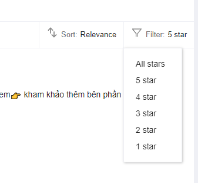

# Mô tả
Lấy dữ liệu thô bình luận và đánh giá mặt hàng cho bài tập lớn môn Học sâu và ứng dụng 
# Cách chạy
1. Cài đặt các thư viện cần thiết
```bash
pip install -r requirements.txt
```
2. Lên trang web Lazada, tìm kiếm từ khóa
3. Nhấn vào từng mặt hàng, ở phần bình luận chọn Filter theo số sao

4. Ctrl + A và Ctrl + C để copy toàn bộ phần văn bản trên trang web
5. Ctrl + V vào file `data/a.txt`
6. Chạy file `parse.py` với biến `RATE` là số sao đã chọn ở bước 3
7. Kết quả sẽ được lưu vào file `{số rating}.csv`
8. Lặp lại các bước từ 2 đến 7 bằng cách chuyển sang trang tiếp theo ở phần bình luận, thay đổi số sao ở phần Filter, hoặc chuyển sang mặt hàng khác để lấy đủ dữ liệu 

> Lưu ý: Giao diện Lazada để tiếng Anh nên trong code sẽ tìm kiếm bằng từ khóa "Verified Purchase"

> Khi trích xuất bình luận, cần để ý trùng lặp + bình luận sinh tự động. 